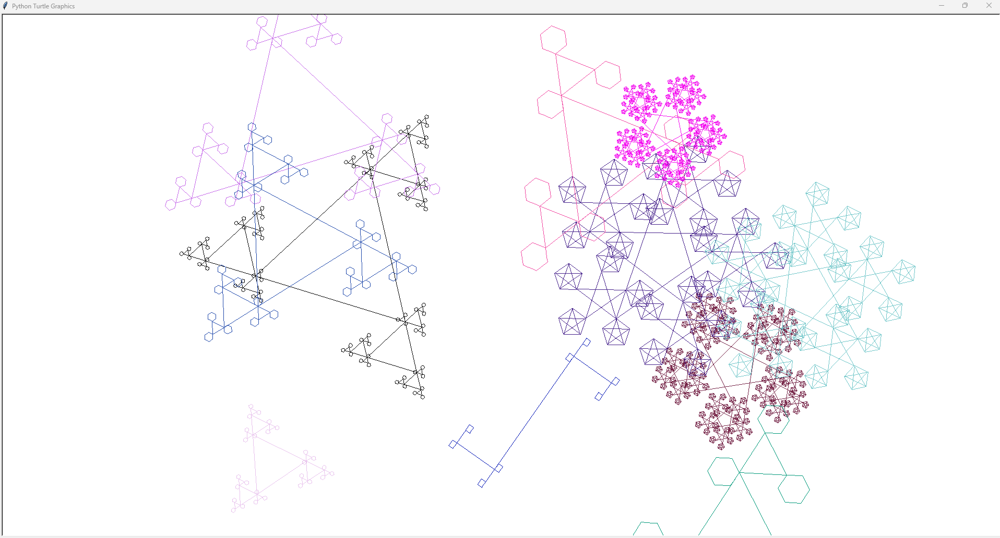
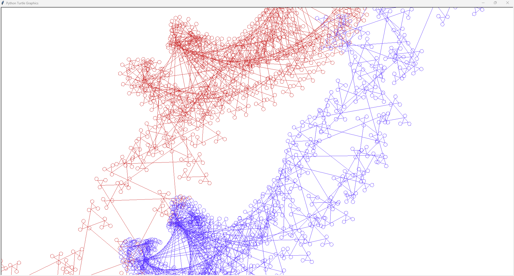
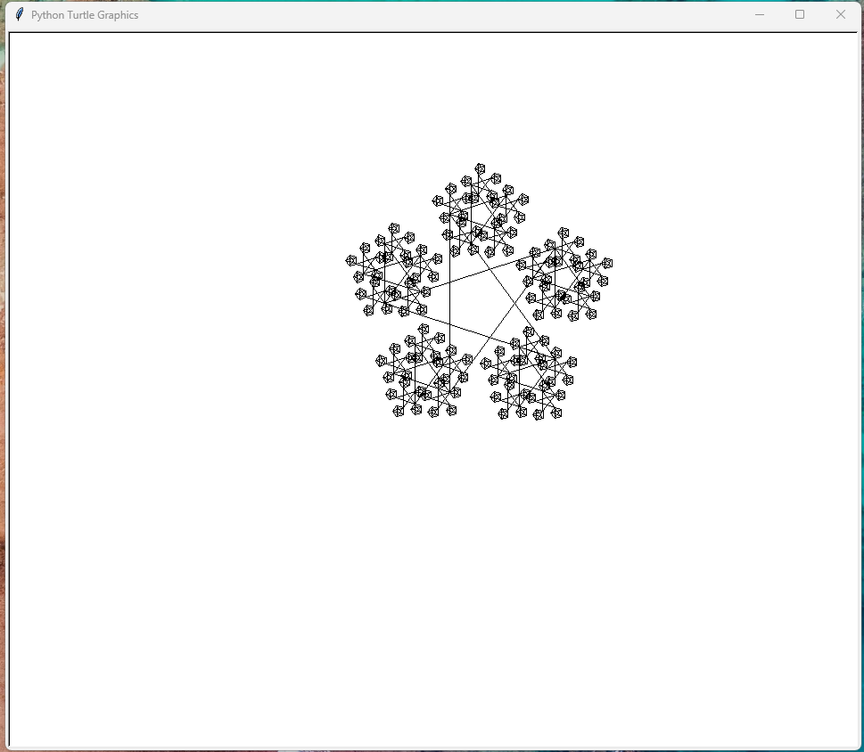
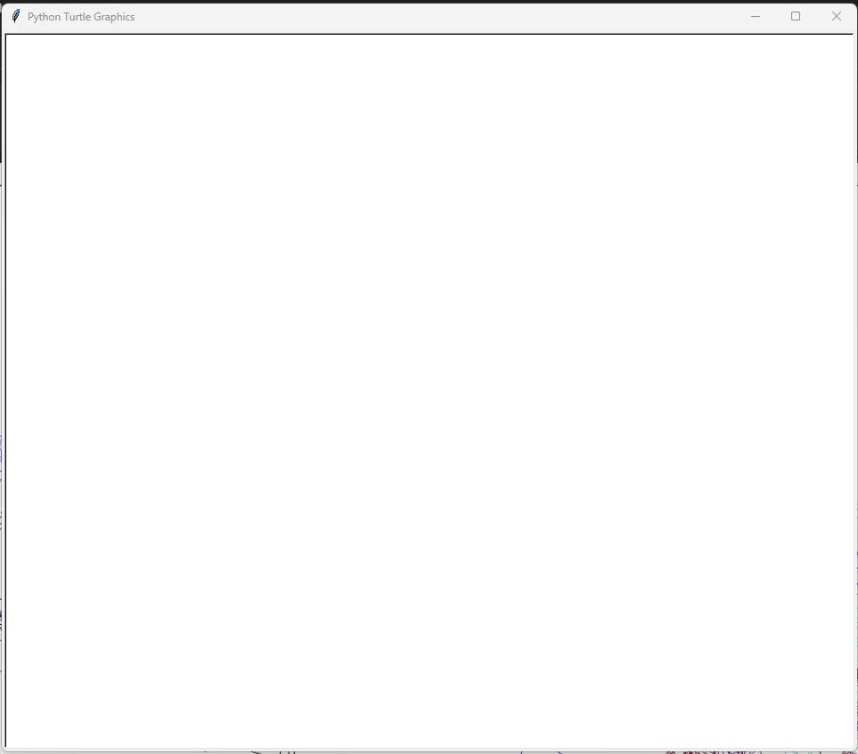
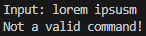
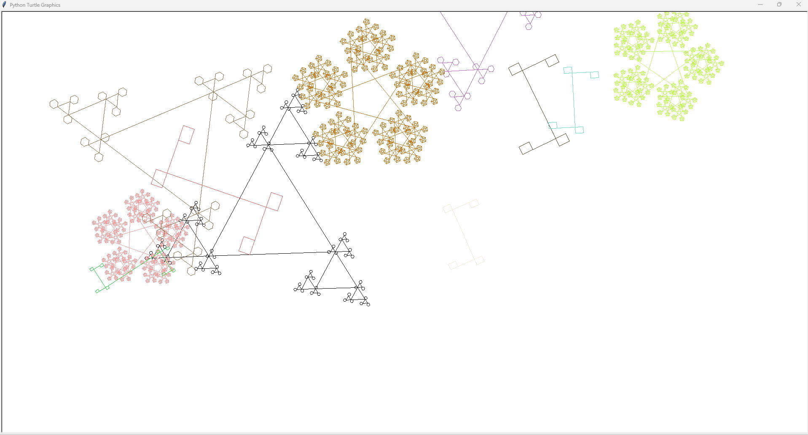
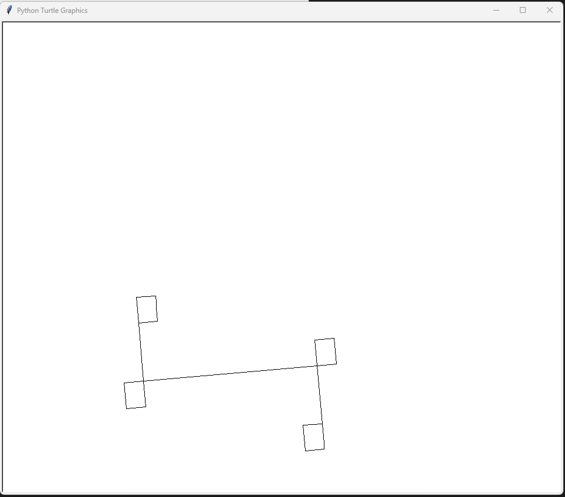
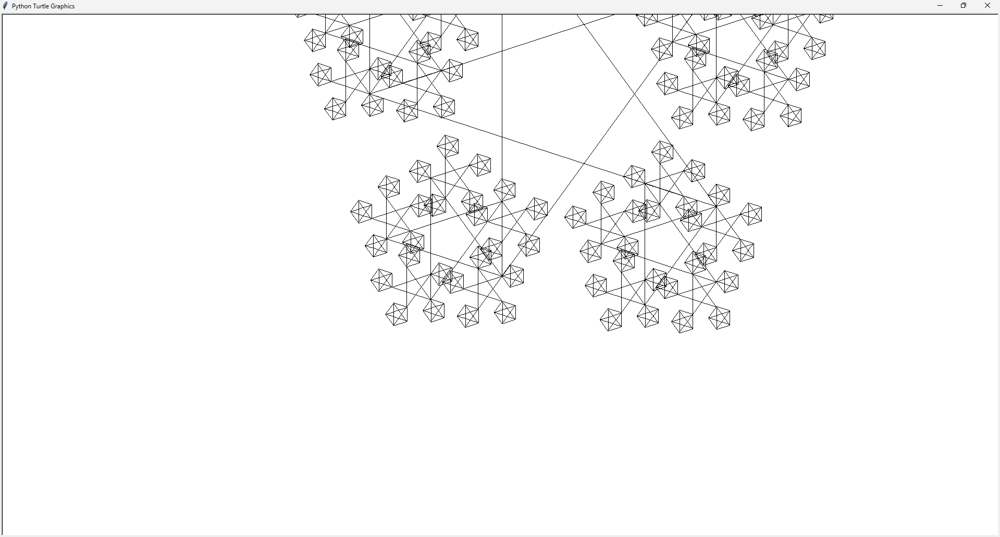

# Mini-Project, Recursive Fractal Art Generator, Documentation: "Taiga" by Derick Su

## Project Description
**Taiga** is an interactive, abstract art program with heavy usage of fractals. Fractals are usually created on the begining of a starting template, or can be created directly by the user. Fractals can vary in "sides" and size, depending on the inputted sides or depth, or side length parameters.

# Usage
## Commands
Commands are what the user types in the *Input:* field Commands are the main way for the user to interact with the program. The avaliable commands the user may excecute are:
### START
<ul >This will promt a start a <u>template</u>. The user must tpe the start command then enter what <u>template</u> they want in the next input: *Enter the starting template:*
<br><i>Avaliable <u>templates</u> are: </i></ul>

<ul> <i><b>empty</b></i><br>
This template is completely devoid of fractals. This is the default starting template.</ul>

<ul> <i><b>taiga</b></i><br>
One three-sided fractal with the depth of 5 along with 10 other random fractals will populate the screen, moving in random directions, before completely drifting away.</ul>

<ul> <i><b>spiral</b></i><br>
Creates two spirals, one blue, one red.</ul>

### STARTHELP
<ul>This will give the user all avaliable starting templates</ul>

### HELP
<ul>This will give a list of all avaliable commands</ul>

### CLEAR
<ul>This will remove all fractals from the screen</ul>

### RANDOM
<ul>This will spawn one random fractal around the center of the screen</ul>

### COUNT
<ul>This will count all of the recursions which has happened in the current run of the program</ul>

### CREATE
<ul>This will make a fractal based off the settings. This command will automatically be excecuted if nothing was entered on the field.</ul>

### SETTINGS
<ul>This wil view the parameters of the fractal generated by the CREATE command</ul>
<ul><i>The Avaliable parameters are: </i></ul>

<ul> <i><b>Side Length</b></i><br>
Determines the largest side length of a fractal.</ul>

<ul> <i><b>Sides</b></i><br>
Determines the "sides" of the fractal. The way the fractals are constructed, fractals with an even number of "sides" will have half of the sides of the actual parameter.</ul>

<ul> <i><b>Depth</b></i><br>
Determines the depth of recursion of the fractal.</ul>

<ul> <i><b>Position X</b></i><br>
Determines the starting x position.</ul>

<ul> <i><b>Position Y</b></i><br>
Determines the starting y position.</ul>

<ul> <i><b>Speed X</b></i><br>
Determines the velocity of the fractal in the x axis.</ul>

<ul> <i><b>Speed Y</b></i><br>
Determines the velocity of the fractal in the y axis.</ul>

<ul> <i><b>Rotation</b></i><br>
Determines the rotation of the fractal.</ul>

<ul> <i><b>Rotation Speed</b></i><br>
Determines the change in rotation of the fractal. Negative values are clockwise and positive values are counterclockwise.</ul>

<ul> <i><b>Red</b></i><br>
Determines the red value in RGB of the fractal.</ul>

<ul> <i><b>Green</b></i><br>
Determines the green value in RGB of the fractal.</ul>

<ul> <i><b>Blue</b></i><br>
Determines the blue value in RGB of the fractal.</ul>

### EDIT
<ul>This will let the user edit all of the settings at once. Alternetively, an individual may enter a parameter as a command to edit that specific parameter.</ul>

# Test Cases
*Due to the random nature of the program, test cases may not perfectly follow the screenshot
## Input: 
```
start
taiga
```

## Input: 
```
start
spiral
```


## Input: 
```

```


## Input: 
```
lorem ipsusm
```
<br>


## Input: 
```
start
taiga
start
67
```
<br>
(nothing is supposed to change with invalid start)
## Input: 
```
random
```


## Input: 
```
side length
700
create
```



# Disscussion
## Reasonable Limits
**Taiga** does not have a maxium for the parameters aside from the RGB colour values. However, this does not mean the user can make a really large fractal. The practical limits of each setting: 
- **Side Length**: Should be small enough to fix inside the screen, anything under 2000 should behave normally. It is not recommended to go over 10000.
- **Sides**: Anything over 10 will lag significantly. It is not recommended to go over 15. #&$(#(&^$&(#^(^#(%(%(&#^%)))))))<<<
- **Depth**: Anything over 5 will be very laggy. It is not recommended to go over 7.

## Recursion Approch
The method of recursion used by **Taiga** is based of of the objects. Each fractal on screen is an object of the <u>Ball</u> class. The parameters of each object determines the way the fractal will be drawn. The function which actually draws the fractal has three main parts: the part which sets up the turtle to draw, only ran the first time it is called; the main loop, which recurses for fractal depth; and the return statement, which returns the amount of times the recursion has ran and is added to the recursion counter.

## Development Process
The original plan for **Taiga** was to make a pentagonal Koch Snowflake. However, the original algorithm was not successful. Yet, the algorithm produced something interesting, so I continued to work on it for a bit to see what I could make out of it. After some improvements, I had made an algorithm that made the fractals we see today. I was quite intrigued by this novel fractal, and therefore decided to keep it. After implementing the basic process for a fractal to work, I wanted to implement a simple spawning system somewhat inspired by Ethan's program. This would later come into conflict with the command system I wanted to implement. Since the check for creating a fractal based on the sides was first, it would have an error if I tried to input a command since it was not able to become an integer. At first I attempted to use the *try, except* statements. This was not able to work. I was not quite sure why that was the case, so I just removed it. The way I resolved issue was by detecting the string inputs first, and detecting the integer inputs last. To check for errors, I added a *try, except* statement which actually worked this time!

## Peer Review
The colourful fractals were suggested by Ethan Wong.